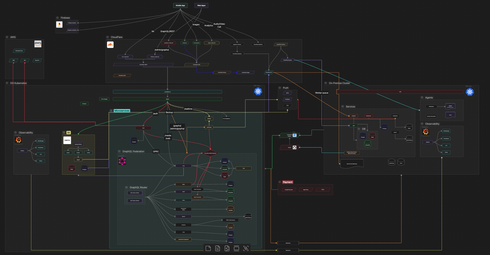
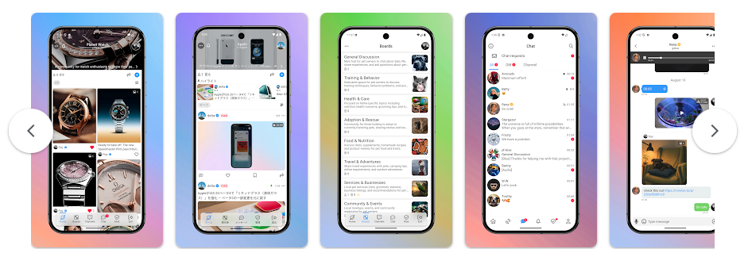
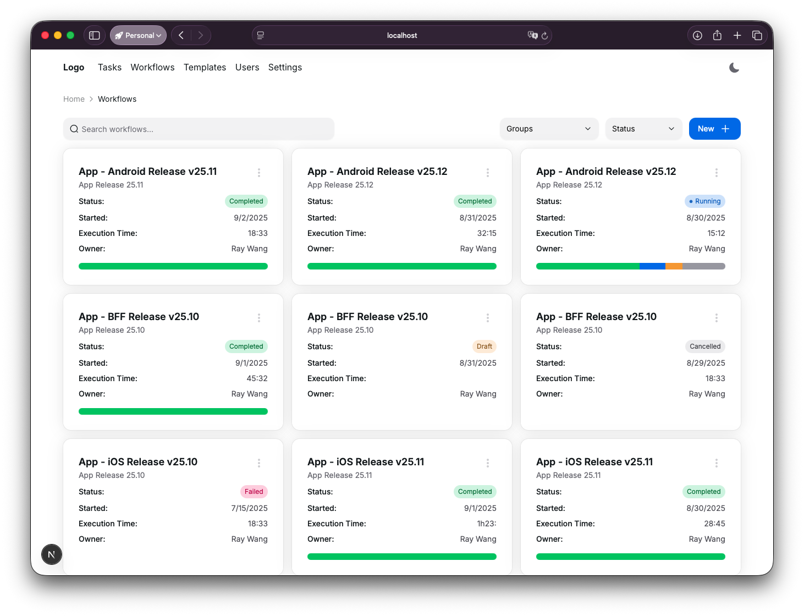
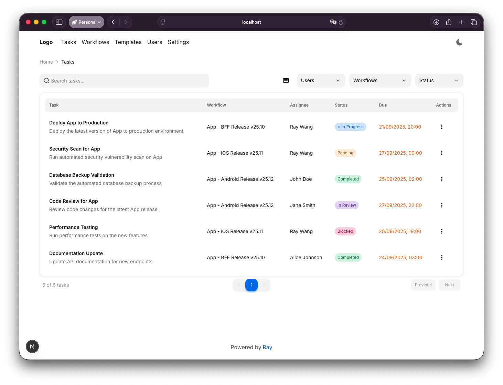
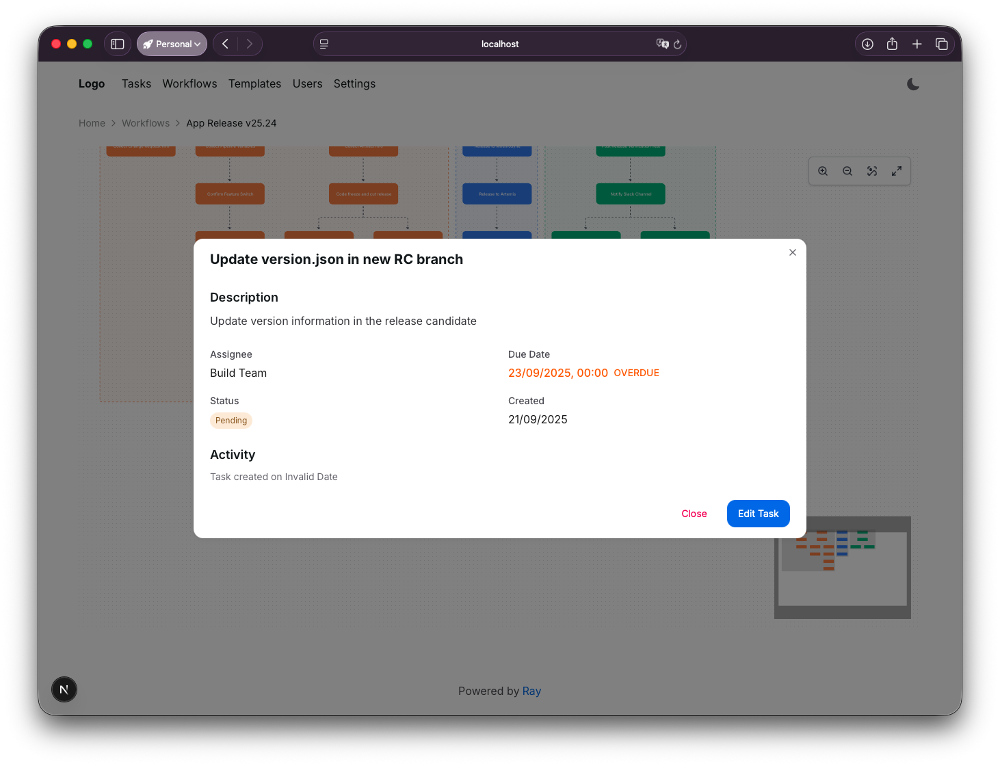
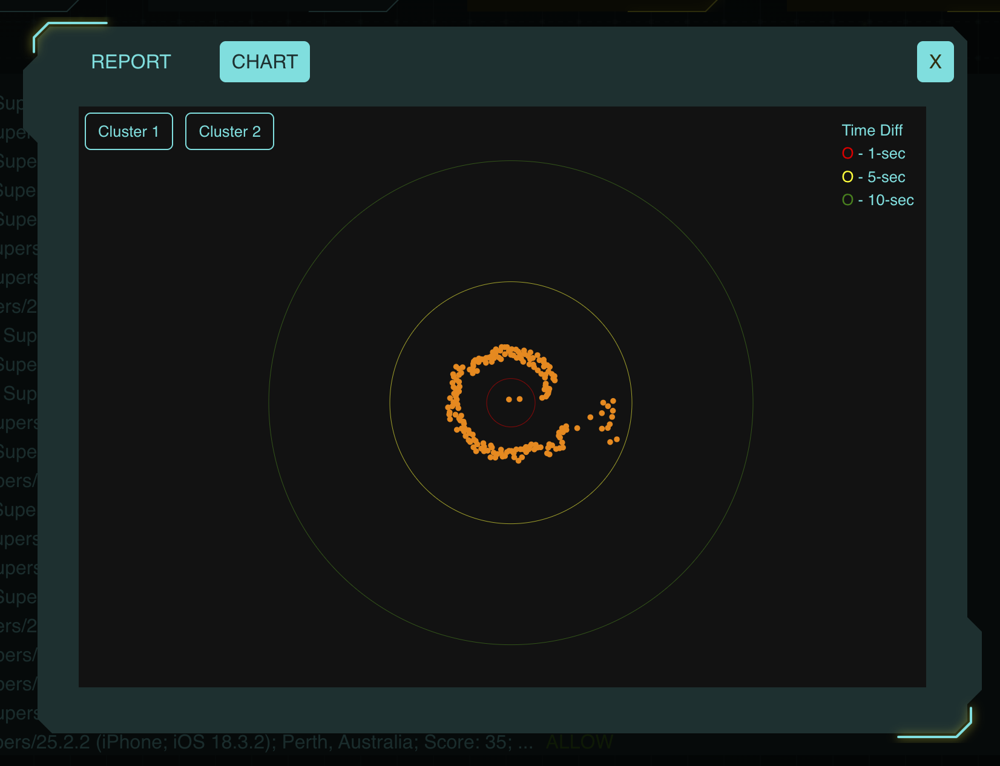
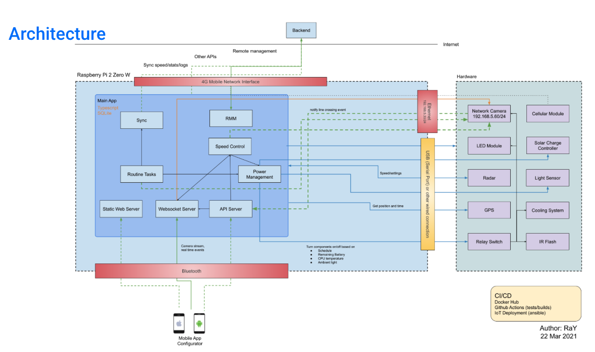
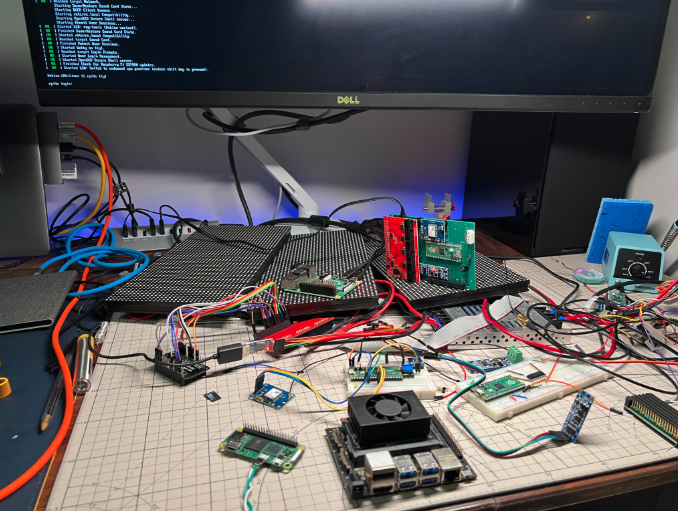
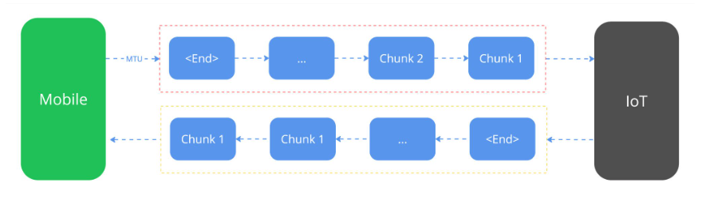
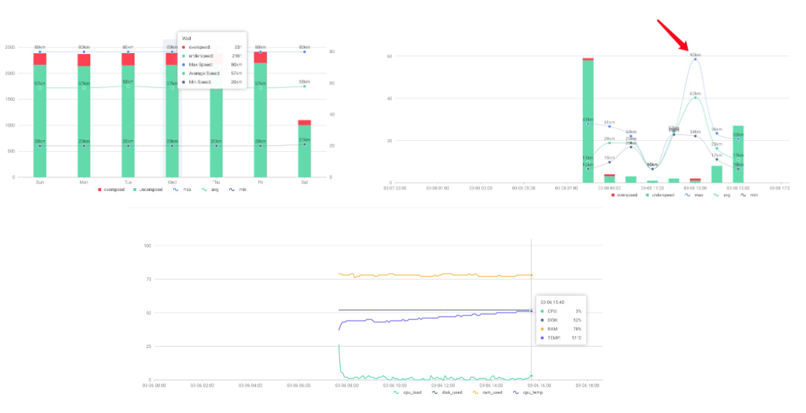

# Random Projects

A few sample projects I have designed and development, end to end.

## Backend System

I don't just draw the system architecture diagrams, I built it from scratch and implement every single service.

## Mobile App

Built using Flutter, a cross-platform mobile app development framework.

## Generic AI assisted workflows-as-code automation platform

Let the automated system replace the need of human coordination using AI across dozens of teams for complex workflows.

## Web application security System

Defending Australia's largest retailer's mobile backend from bot attacks in real-time.

<video width="1280" height="720" controls>
<source src="assets/bot.mp4" type="video/mp4">
Your browser does not support the video tag.
</video>

Bot patterns visualisation

## Hardware Project

Integration of 10+ hardware components

Control the device using custom Bluetooth communication protocol using mobile app.

<video width="1280" height="720" controls>
<source src="assets/iot-4.mp4" type="video/mp4">
Your browser does not support the video tag.
</video>

Real-time traffic dashboard.

